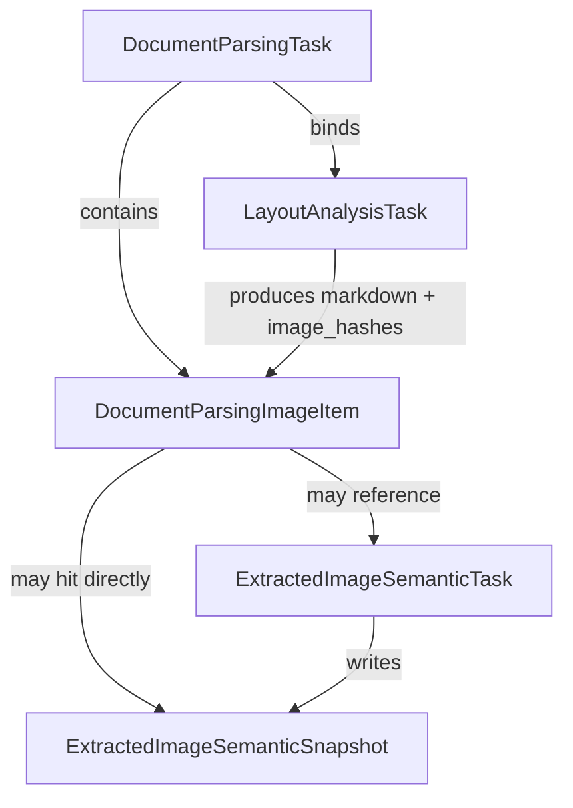

# 文档解析任务模型说明

## 1. 背景与目标

当前文档解析链路不是单一任务，而是由两个阶段串联组成：

1. 版面分析任务（`LayoutAnalysisTask`）
2. 图片语义分析任务（`ExtractedImageSemanticTask`）

在业务语义上，`DocumentParsingTask` 不再等同于“PDF 转 Markdown 任务”，而是一个聚合父任务，用来表达“这次文档解析请求是否整体完成”。

这次模型拆分的目标有三个：

- 明确区分“版面分析结果”与“文档解析整体结果”。
- 明确图片语义分析是依赖版面分析输出图片列表的后续阶段。
- 明确复用规则和状态聚合规则，避免把“图片任务已分发”误判为“文档解析已完成”。

## 2. 核心模型

### 2.1 `LayoutAnalysisTask`

`LayoutAnalysisTask` 表示一次版面分析任务，底层负责调用版面分析能力，将 PDF 转换为 Markdown，并产出图片列表。

它的核心职责是：

- 按 `file_id + layout_model_key` 复用已成功的版面分析结果。
- 在成功后保存：
  - `markdown`
  - `image_hashes`
- 为后续图片语义分析提供输入。

关键字段：

- `requested_layout_model`：调用方请求的版面分析模型。
- `target_layout_model`：最终实际执行的版面分析模型。
- `layout_model_key`：用于复用与活动任务去重的稳定键。
- `layout_result_source_task_id`：复用已有版面分析结果时的来源任务 ID。
- `markdown`：版面分析产出的 Markdown。
- `image_hashes`：版面分析产出的图片引用映射，键通常是源图片位置标识，值是图片哈希。
- `status`：版面分析任务状态，取值为 `pending`、`running`、`succeeded`、`failed`。

约束与关系：

- 活动任务唯一约束：同一 `document_id + layout_model_key` 下，只允许存在一条 `pending/running` 任务。
- 成功结果复用维度：`file_id + layout_model_key`。

### 2.2 `DocumentParsingTask`

`DocumentParsingTask` 是文档解析聚合父任务，表示一次“完整文档解析请求”。

它本身不直接执行版面分析，而是：

- 绑定一个 `layout_task_id`
- 追踪本次文档解析涉及的图片项
- 聚合版面分析阶段和图片语义阶段的整体状态

关键字段：

- `requested_layout_model` / `target_layout_model` / `layout_model_key`
- `requested_image_model` / `target_image_model` / `image_model_key`
- `layout_task_id`：关联的版面分析任务 ID。
- `status`：聚合状态，取值为 `pending`、`running`、`succeeded`、`failed`。
- `markdown`：当版面分析成功后，从 `LayoutAnalysisTask` 同步过来的 Markdown。
- `image_hashes`：当版面分析成功后，从 `LayoutAnalysisTask` 同步过来的图片映射。
- `image_total_count`：该次文档解析下的图片项总数。
- `image_succeeded_count`：已成功的图片项数量。
- `image_failed_count`：已失败的图片项数量。
- `error_message`：聚合失败原因。

约束与关系：

- 活动任务唯一约束：同一 `document_id + layout_model_key + image_model_key` 下，只允许存在一条 `pending/running` 任务。
- 整体结果复用维度：`file_id + layout_model_key + image_model_key`。
- 只有 `status == succeeded` 的父任务才可作为完整文档解析结果复用。

### 2.3 `DocumentParsingImageItem`

`DocumentParsingImageItem` 表示某次 `DocumentParsingTask` 下的一张图片实例。

它的作用是把“文档解析父任务”与“图片语义任务/快照”连接起来，让父任务能够精确聚合每张图片的完成状态。

关键字段：

- `document_parsing_task_id`：所属文档解析任务。
- `source_key`：该图片在版面分析结果中的来源标识。
- `file_hash`：图片哈希。
- `extracted_image_id`：落库后的抽取图片 ID。
- `semantic_task_id`：关联的图片语义任务 ID，可为空。
- `status`：图片项状态，取值为 `pending`、`running`、`succeeded`、`failed`。
- `result_source`：结果来源。
- `error_message`：图片项失败原因。

`result_source` 的取值语义：

- `semantic_snapshot`：命中了已存在的模型级语义快照，未新建语义任务。
- `reused_semantic_task`：复用了已有的进行中图片语义任务。
- `submitted_semantic_task`：为该图片新建了图片语义任务。

约束与关系：

- 唯一约束：同一 `document_parsing_task_id + source_key` 下只允许一条图片项记录。

### 2.4 `ExtractedImageSemanticSnapshot`

`ExtractedImageSemanticSnapshot` 表示一张抽取图片在某个目标模型上的可复用语义结果快照。

它的核心职责是：

- 把图片语义复用从“是否有旧描述”升级为“是否有该模型下的有效结果”。
- 让不同图片语义模型之间互不误复用。

关键字段：

- `extracted_image_id`：抽取图片 ID。
- `target_model_key`：语义模型稳定键。
- `result_model`：实际产出结果时使用的模型标识。
- `description`：图片语义描述。
- `source_task_id`：生成该快照的图片语义任务 ID。

约束与关系：

- 唯一约束：`extracted_image_id + target_model_key`。

## 3. 任务关系

可以把这四层理解为：

- `LayoutAnalysisTask` 负责“先把文档拆开”
- `DocumentParsingImageItem` 负责“把这次文档解析涉及到的图片逐项登记”
- `ExtractedImageSemanticSnapshot` 负责“判断某张图片在某个模型下是否已经有可复用结果”
- `DocumentParsingTask` 负责“汇总这次文档解析整体是否完成”

## 4. 状态语义

### 4.1 `DocumentParsingTask.status`

`DocumentParsingTask.status` 是严格聚合状态，不再表示“版面分析是否完成”，也不表示“图片语义任务是否已经分发”。

它的判定规则是：

- `failed`
  - 关联的 `LayoutAnalysisTask` 不存在
  - `LayoutAnalysisTask.status == failed`
  - 任一必要图片项最终失败
- `succeeded`
  - `LayoutAnalysisTask.status == succeeded`
  - 且该任务下所有必要图片项都已成功
  - 如果没有图片项，也可以直接成功
- `running`
  - 版面分析已成功，但仍有图片项尚未完成
  - 或版面分析本身处于 `running`
- `pending`
  - 版面分析尚未开始

### 4.2 `layout_status` 与 `image_analysis_status`

对外接口中，`DocumentParsingTask` 会额外返回两个阶段状态：

- `layout_status`
  - 直接反映关联 `LayoutAnalysisTask.status`
- `image_analysis_status`
  - 表示图片语义分析阶段的聚合状态
  - 仅在版面分析成功后，才真正进入图片阶段判断

`image_analysis_status` 的判定语义：

- `pending`：版面分析尚未开始
- `running`：版面分析进行中，或图片项尚未全部完成
- `succeeded`：所有图片项都已完成，或者没有图片项
- `failed`：版面分析失败，或任一图片项失败

### 4.3 接口提前暴露版面分析结果

即使 `DocumentParsingTask.status == running`，只要：

- `layout_status == succeeded`

对外接口仍然可以返回：

- `markdown`
- `image_hashes`

这表示“版面分析阶段结果已可读”，但“整次文档解析尚未严格完成”。

## 5. 复用规则

### 5.1 版面分析复用

复用维度：

- `file_id + layout_model_key`

含义：

- 同一个文件、同一个版面分析模型下，成功的版面分析结果可以复用。

### 5.2 文档解析整体复用

复用维度：

- `file_id + layout_model_key + image_model_key`

含义：

- 只有当版面分析模型和图片语义模型都匹配，并且历史 `DocumentParsingTask.status == succeeded` 时，才可整体复用。

这意味着：

- 仅版面分析成功但图片阶段未完成，不可作为文档解析整体结果复用。
- “图片任务已分发”不等于“文档解析整体成功”。

### 5.3 图片语义复用

复用维度：

- `extracted_image_id + target_model_key`

含义：

- 某张图片是否可以跳过语义任务，不再看旧的全局 `semantic_description` 是否存在，而是看该模型对应的 `ExtractedImageSemanticSnapshot` 是否存在。

这保证：

- 不同模型之间不会误复用
- 语义结果复用语义与模型选择保持一致

## 6. 编排流程

### 6.1 创建文档解析任务

调用 `/document-parsing/tasks` 时，系统会：

1. 解析 `layout_model` 和 `image_model`
2. 尝试按 `document_id + layout_model_key + image_model_key` 复用活动父任务
3. 尝试按 `file_id + layout_model_key + image_model_key` 复用已完成父任务
4. 若不能复用，则绑定或创建 `LayoutAnalysisTask`
5. 创建新的 `DocumentParsingTask`

### 6.2 版面分析完成后

`LayoutAnalysisTask` 成功后会产出：

- `markdown`
- `image_hashes`

随后触发与该 `layout_task_id` 绑定的所有 `DocumentParsingTask` 进行同步。

### 6.3 初始化图片项

父任务同步时，如果版面分析已成功，则会根据 `image_hashes` 逐项生成 `DocumentParsingImageItem`。

对每个图片项，系统会按顺序判断：

1. 是否已存在同 `source_key` 的图片项
2. 是否命中 `ExtractedImageSemanticSnapshot`
3. 是否可复用已有 `ExtractedImageSemanticTask`
4. 否则新建 `ExtractedImageSemanticTask`

### 6.4 图片语义任务完成后

图片语义任务成功或失败时，会反向触发对应 `DocumentParsingTask` 重新聚合。

聚合时会：

- 把图片语义任务状态同步回 `DocumentParsingImageItem.status`
- 重算 `image_total_count`
- 重算 `image_succeeded_count`
- 重算 `image_failed_count`
- 重新判定 `DocumentParsingTask.status`

## 7. 典型时序示例

假设用户提交一次文档解析请求，版面分析模型为 `marker`，图片语义模型为某个 LLM 默认模型。

### 7.1 提交任务

- 创建 `DocumentParsingTask`
- 绑定一个 `LayoutAnalysisTask`
- 此时父任务通常为 `pending` 或 `running`

### 7.2 版面分析成功

- `LayoutAnalysisTask.status = succeeded`
- 得到 `markdown` 和 `image_hashes`
- 父任务同步后：
  - `layout_status = succeeded`
  - `DocumentParsingTask.markdown` 已可读取
  - 开始初始化图片项

### 7.3 图片项初始化

假设一共有 3 张图片：

- 第 1 张命中 `semantic_snapshot`
- 第 2 张复用了已有 `ExtractedImageSemanticTask`
- 第 3 张新建了 `ExtractedImageSemanticTask`

这时：

- `image_total_count = 3`
- `image_succeeded_count = 1`
- 父任务保持 `running`

### 7.4 图片阶段全部完成

当剩余两张图片也都完成后：

- `image_succeeded_count = 3`
- `image_failed_count = 0`
- `DocumentParsingTask.status = succeeded`

如果其中任意一张失败，则：

- `DocumentParsingTask.status = failed`

## 8. 对外接口语义

### 8.1 `/layout-analysis/*`

`/layout-analysis/*` 表示版面分析任务接口，只关心：

- 版面分析是否完成
- Markdown 是否生成
- 图片列表是否生成

对应能力：

- `POST /layout-analysis/tasks`
- `GET /layout-analysis/tasks/{task_id}`
- `GET /layout-analysis/results/{document_id}`

### 8.2 `/document-parsing/*`

`/document-parsing/*` 表示完整文档解析接口，关心的是：

- 版面分析阶段
- 图片语义阶段
- 两者聚合后的整体完成状态

对应能力：

- `POST /document-parsing/tasks`
- `GET /document-parsing/tasks/{task_id}`
- `GET /document-parsing/results/{document_id}`

其中这些字段需要按聚合语义理解：

- `layout_task_id`：父任务绑定的版面分析任务 ID
- `layout_status`：版面分析阶段状态
- `image_analysis_status`：图片语义阶段状态
- `image_total_count`：图片项总数
- `image_succeeded_count`：图片项成功数
- `image_failed_count`：图片项失败数
- `image_items`：逐张图片的状态明细

### 8.3 为什么移除旧 `/document-parsing/pdf-to-markdown*`

旧接口名容易把“版面分析任务”和“文档解析任务”混为一谈。

重构后：

- 版面分析单独归到 `/layout-analysis/*`
- 文档解析继续保留在 `/document-parsing/*`

这样接口语义与任务模型保持一致。

## 9. 遗留兼容说明

### 9.1 旧任务表迁移

历史上的 `document_parsing_tasks` 已在迁移语义中下沉为 `layout_analysis_tasks`。

可以理解为：

- 旧表表达的是“版面分析阶段任务”
- 新表 `document_parsing_tasks` 才表达“文档解析聚合父任务”

### 9.2 旧图片语义字段保留

`extracted_images.semantic_description*` 仍然保留，但只作为遗留兼容字段，不再作为主复用依据。

新的主复用依据是：

- `ExtractedImageSemanticSnapshot`

也就是按模型维度管理的图片语义快照。

## 10. 当前实现要点总结

当前任务模型的核心语义可以概括为：

- `LayoutAnalysisTask` 负责产出版面分析结果
- `DocumentParsingTask` 负责聚合整次文档解析是否完成
- `DocumentParsingImageItem` 负责把图片级状态纳入父任务聚合
- `ExtractedImageSemanticSnapshot` 负责按模型维度复用图片语义结果

最重要的判断标准是：

- `DocumentParsingTask.succeeded` 必须表示整次任务严格完成
- 不能再把“图片任务已分发”当成“文档解析已完成”

